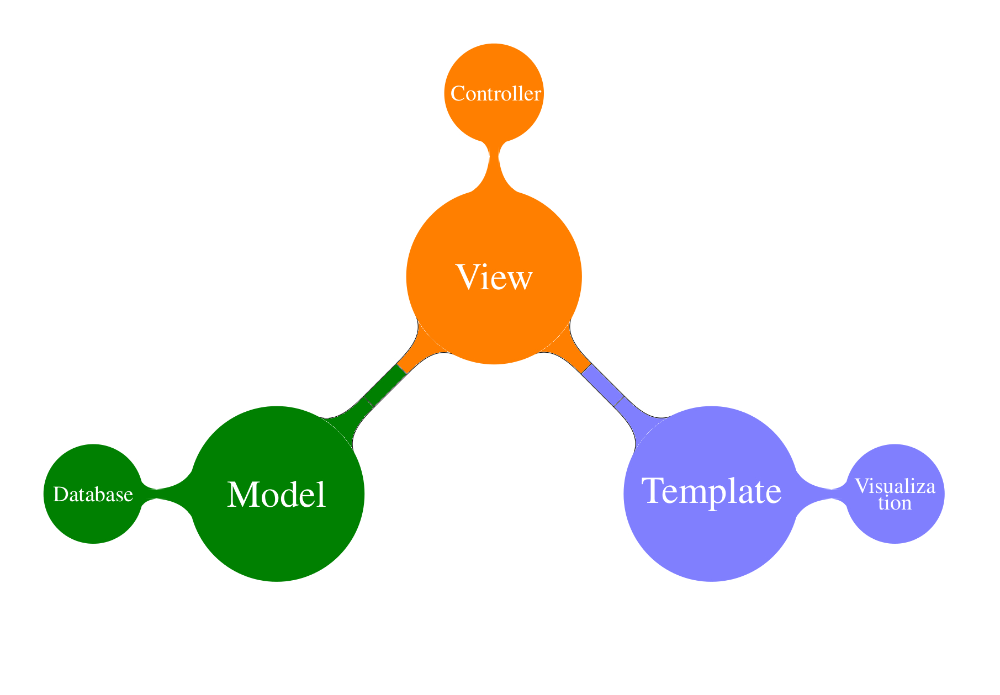
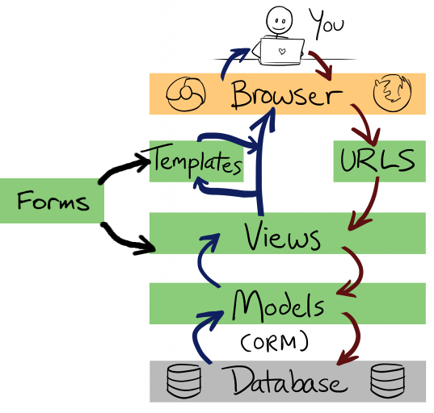
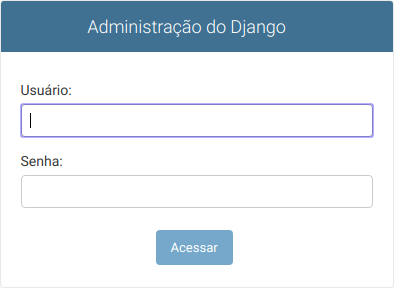
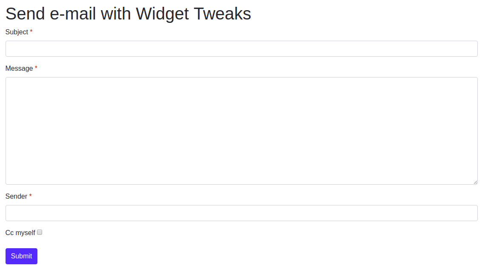

# Passo a passo

# django-forms-tutorial


## Criando projeto com boilerplate

```
git clone https://github.com/rg3915/django-boilerplate.git /tmp/django-boilerplate
cp /tmp/django-boilerplate/boilerplatesimple.sh .
source boilerplatesimple.sh
```


## Como o Django funciona?



---



---

### 1 - Admin - Login



```html
<form id="login-form" action="/admin/login/?next=/admin/" method="post">
  <input type="hidden" name="csrfmiddlewaretoken" value="n1RnvKj9peZB0XwpAFmuWjKHwotjBTjXEQMtSz1vYD6Vl8SUjpXG8s5YMHnkUZkq">
  <div class="form-row">

    <label class="required" for="id_username">Usuário:</label>
    <input id="id_username" type="text" name="username" autofocus="" autocapitalize="none" autocomplete="username" maxlength="150" required="">
  </div>
  <div class="form-row">

    <label class="required" for="id_password">Senha:</label>
    <input id="id_password" type="password" name="password" autocomplete="current-password" required="">
    <input type="hidden" name="next" value="/admin/">
  </div>

  <div class="submit-row">
    <input type="submit" value="Acessar">
  </div>
</form>
```

https://github.com/django/django/blob/master/django/contrib/admin/templates/admin/login.html#L44-L63

---

### 2 - [Building a form](https://docs.djangoproject.com/en/3.2/topics/forms/#building-a-form)

https://docs.djangoproject.com/en/3.2/topics/forms/#building-a-form

```html
<form action="." method="POST">
    <label for="first_name">Name: *</label>
    <input id="first_name" type="text" name="first_name" value="{{ current_first_name }}">
    <input type="submit" value="OK">
</form>
```

No nosso projeto:

Edite `crm/urls.py`

```python
urlpatterns = [
    path('', v.person_list, name='person_list'),
    path('<int:pk>/', v.person_detail, name='person_detail'),
    path('create/', v.person_create, name='person_create'),
]
```

Edite `crm/views.py`

```python
from django.shortcuts import redirect, render

from .models import Person


def person_list(request):
    template_name = 'crm/person_list.html'
    object_list = Person.objects.all()
    context = {'object_list': object_list}
    return render(request, template_name, context)


def person_detail(request, pk):
    template_name = 'crm/person_detail.html'
    obj = Person.objects.get(pk=pk)
    context = {'object': obj}
    return render(request, template_name, context)


def person_create(request):
    template_name = 'crm/person_form0.html'
    # import ipdb; ipdb.set_trace()
    return render(request, template_name)
```

```html
<!-- person_form0.html -->



  <h1>Formulário</h1>
  <div class="cols-6">
    <form action="." method="POST">
      <div class="col-sm-6">
        <div>
          <label for="id_first_name">Nome</label>
          <input id="id_first_name" type="text" name="first_name">
        </div>

        <div>
          <label for="id_last_name">Sobrenome</label>
          <input id="id_last_name" type="text" name="last_name">
        </div>

        <div>
          <button type="submit">Salvar</button>
        </div>
      </div>
    </form>
  </div>

```

Complemente o HTML com as classes.

```html
<!-- person_form0.html -->



  <style>
    .required:after {
      content: "*";
      color: red;
    }
  </style>



  <h1>Formulário</h1>
  <div class="cols-6">
    <form class="form-horizontal" action="." method="POST">
      <div class="col-sm-6">
        <div class="form-group">
          <label for="id_first_name" class="required">Nome</label>
          <input id="id_first_name" type="text" name="first_name" class="form-control">
        </div>

        <div class="form-group">
          <label for="id_last_name">Sobrenome</label>
          <input id="id_last_name" type="text" name="last_name" class="form-control">
        </div>

        <div class="form-group">
          <button type="submit" class="btn btn-primary">Salvar</button>
        </div>
      </div>
    </form>
  </div>

```

Em `crm/views.py`

Rodando a aplicação com ipdb, vemos que precisamos do

```html

```

E continuando o debug, precisamos separar GET de POST.

```python
def person_create(request):
    template_name = 'crm/person_form0.html'
    if request.method == 'GET':
        print('GET')
    else:
        print('POST')
    return render(request, template_name)
```

E depois pegamos os valores dos inputs com

```python
...
    first_name = request.POST.get('first_name')
    last_name = request.POST.get('last_name')
    print(first_name, last_name)
```

Então podemos salvar os dados da seguinte forma:

```python
def person_create(request):
    template_name = 'crm/person_form0.html'
    if request.method == 'GET':
        print('GET')
    else:
        print('POST')

        first_name = request.POST.get('first_name')
        last_name = request.POST.get('last_name')
        print(first_name, last_name)

        Person.objects.create(first_name=first_name, last_name=last_name)

    return render(request, template_name)
```

Refatorando o código

```python
def person_create(request):
    template_name = 'crm/person_form0.html'

    if request.method == 'POST':
        first_name = request.POST.get('first_name')
        last_name = request.POST.get('last_name')

        Person.objects.create(first_name=first_name, last_name=last_name)

        return redirect('crm:person_list')

    return render(request, template_name)
```

Edite `crm/forms.py`

```python
class PersonForm0(forms.ModelForm):
    required_css_class = 'required'

    class Meta:
        model = Person
        fields = ('first_name', 'last_name')
```

Edite `crm/views.py`

```python
from .forms import PersonForm0


def person_create(request):
    template_name = 'crm/person_form0.html'
    form = PersonForm0(request.POST or None)

    if request.method == 'POST':
        if form.is_valid():
            form.save()
            return redirect('crm:person_list')
        else:
            print(form.errors)

    context = {'form': form}
    return render(request, template_name, context)
```

Acrescente valores inválidos, como `first_name` vazio ou texto muito longo.

```html
...
.errorlist {
  list-style: none;
  color: red;
}
...
{{ form.first_name.errors }}
...
{{ form.last_name.errors }}
...
```

### form 1

Agora vamos renderizar todos os campos do formulário na mão.

https://docs.djangoproject.com/en/3.2/topics/forms/#rendering-fields-manually

Edite `crm/views.py`

```python
def person_create(request):
    template_name = 'crm/person_form1.html'
    form = PersonForm0(request.POST or None)

    if request.method == 'POST':
        if form.is_valid():
            form.save()
            return redirect('crm:person_list')

    context = {'form': form}
    return render(request, template_name, context)
```

```html
...
<div class="form-group">
  <!-- <label for="{{ form.first_name.id_for_label }}" class="required">Nome</label> -->
  {{ form.first_name.label_tag }}
  {{ form.first_name }}
  {{ form.first_name.errors }}
</div>

<div class="form-group">
  {{ form.last_name.label_tag }}
  {{ form.last_name }}
  {{ form.last_name.errors }}
</div>
...
```

Edite `crm/forms.py`

```python
class PersonForm1(forms.ModelForm):
    required_css_class = 'required'

    class Meta:
        model = Person
        fields = ('first_name', 'last_name')

    def __init__(self, *args, **kwargs):
        super(PersonForm1, self).__init__(*args, **kwargs)
        for field_name, field in self.fields.items():
            field.widget.attrs['class'] = 'form-control'
```

Renderizando todos os campos com loop.

```html
...

  <div class="form-group">
    {{ field.errors }}
    {{ field.label_tag }}
    {{ field }}
    
      <small class="text-muted">{{ field.help_text|safe }}</small>
    
  </div>

...
```

Ou simplesmente

```html
{{ form.as_p }}
```

remova o estilo de `.required:after`

E finalmente o `PersonForm` completo

```python
# crm/views.py
def person_create(request):
    template_name = 'crm/person_form.html'
    form = PersonForm(request.POST or None)

    if request.method == 'POST':
        if form.is_valid():
            form.save()
            return redirect('crm:person_list')

    context = {'form': form}
    return render(request, template_name, context)
```

```python
# crm/forms.py
class PersonForm(forms.ModelForm):
    required_css_class = 'required'

    class Meta:
        model = Person
        # fields = '__all__'
        fields = (
            'first_name',
            'last_name',
            'email',
            'address',
            'address_number',
            'complement',
            'district',
            'city',
            'uf',
            'cep',
            'country',
            'cpf',
            'rg',
            'cnh',
            'active',
        )

    def __init__(self, *args, **kwargs):
        super(PersonForm, self).__init__(*args, **kwargs)
        for field_name, field in self.fields.items():
            field.widget.attrs['class'] = 'form-control'
        self.fields['active'].widget.attrs['class'] = None
```

Mostrar `person_form.html` pronto.


### Editar

Edite `crm/urls.py`

```python
...
path('<int:pk>/update', v.person_update, name='person_update'),
...
```

Edite `crm/views.py`

```python
def person_update(request, pk):
    template_name = 'crm/person_form.html'
    instance = Person.objects.get(pk=pk)
    form = PersonForm(request.POST or None, instance=instance)

    if request.method == 'POST':
        if form.is_valid():
            form.save()
            return redirect('crm:person_list')

    context = {'form': form}
    return render(request, template_name, context)
```


## Tela de Contato com forms.py e Django Widget Tweaks

https://pypi.org/project/django-widget-tweaks/

```
pip install django-widget-tweaks
```

Editar `settings.py`

```python
INSTALLED_APPS = [
    ...
    'widget_tweaks',
    ...
]
```

```python
# crm/forms.py
class ContactForm(forms.Form):
    subject = forms.CharField(max_length=100)
    message = forms.CharField(widget=forms.Textarea)
    sender = forms.EmailField()
    cc_myself = forms.BooleanField(required=False)
```


```html
<!-- contact_form.html -->




  <title>Contact</title>




  <style>
    span.required:after {
      content: "*";
      color: red;
    }
  </style>

  <h1>Send e-mail with Widget Tweaks</h1>
  <form class="form" method="POST">
    
    
      <div class="form-group has-error ">
        <label for="{{ field.id_for_label }}">
          
            <span class="required">{{ field.label }} </span>
          
            {{ field.label }}
          
        </label>
        
        
          <span class="text-muted">{{ error }}</span>
        
      </div>
    
    <button type="submit" class="btn btn-primary">Submit</button>
  </form>




  <script>
    $(document).ready(function(){
      $('#id_cc_myself').removeClass('form-control');
    });
  </script>

```



Editar `crm/urls.py`

```python
path('contact/send/', v.send_contact, name='send_contact'),
```

Editar `crm/views.py`

```python
from django.core.mail import send_mail


def send_contact(request):
    template_name = 'crm/contact_form.html'
    form = ContactForm(request.POST or None)

    if request.method == 'POST':
        data = request.POST
        subject = data.get('subject')
        message = data.get('message')
        sender = data.get('sender')

        if form.is_valid():
            send_mail(
                subject,
                message,
                sender,
                ['localhost'],
                fail_silently=False,
            )
            return redirect('core:index')

    context = {'form': form}
    return render(request, template_name, context)
```

Editar `nav.html`

```html
<li class="nav-item">
  <a class="nav-link" href="">Contato</a>
</li>
```

Editar `base.html`

```html

```

Enviar o e-mail com MailHog.

```
docker run -d -p 1025:1025 -p 8025:8025 mailhog/mailhog
```

Configurar `settings.py`

```
EMAIL_BACKEND = 'django.core.mail.backends.smtp.EmailBackend'

DEFAULT_FROM_EMAIL = config('DEFAULT_FROM_EMAIL', 'webmaster@localhost')
EMAIL_HOST = config('EMAIL_HOST', '0.0.0.0')  # localhost
EMAIL_PORT = config('EMAIL_PORT', 1025, cast=int)
EMAIL_HOST_USER = config('EMAIL_HOST_USER', '')
EMAIL_HOST_PASSWORD = config('EMAIL_HOST_PASSWORD', '')
EMAIL_USE_TLS = config('EMAIL_USE_TLS', default=False, cast=bool)
```


### Django Bootstrap

https://github.com/zostera/django-bootstrap4

```
pip install django-bootstrap4
```

```python
# settings.py
INSTALLED_APPS = [
    ...
    'bootstrap4',
```

https://getbootstrap.com/

Edite `base.html`

```html
<!-- base.html -->
  <!-- Bootstrap core CSS -->
  <link rel="stylesheet" href="https://stackpath.bootstrapcdn.com/bootstrap/4.4.1/css/bootstrap.min.css">

  <!-- jQuery -->
  <script src="https://code.jquery.com/jquery-3.4.1.min.js"></script>
  <!-- Bootstrap core JS -->
  <script src="https://cdn.jsdelivr.net/npm/popper.js@1.16.0/dist/umd/popper.min.js"></script>
  <script src="https://stackpath.bootstrapcdn.com/bootstrap/4.4.1/js/bootstrap.min.js"></script>
```


Edite `person_bootstrap_form.html`

```html
<!-- person_bootstrap_form.html -->




  <h1>Bootstrap form</h1>

  <form class="form" method="POST">
    

    

    
        <button type="submit" class="btn btn-primary">Submit</button>
    
  </form>


```

Editar `nav.html`

```html
<li class="nav-item">
  <a class="nav-link" href="">Bootstrap Create</a>
</li>
```

Edite `crm/urls.py`

```python
path('bootstrap/create/', v.PersonBootstrapCreate.as_view(), name='person_bootstrap_create'),
```

Edite `crm/views.py`

```python
from django.views.generic import CreateView


class PersonBootstrapCreate(CreateView):
    model = Person
    form_class = PersonForm
    template_name = 'crm/person_bootstrap_form.html'
```

Leia [django-cbv-tutorial](https://github.com/rg3915/django-cbv-tutorial)

E veja a Live [Django Class Based View como você nunca viu](https://youtu.be/C7Ecugxa7ic)


---

### Django Crispy Forms

https://django-crispy-forms.readthedocs.io/en/latest/


```
pip install django-crispy-forms
```

https://simpleisbetterthancomplex.com/tutorial/2018/11/28/advanced-form-rendering-with-django-crispy-forms.html

```python
# settings.py
INSTALLED_APPS = [
    ...
    'crispy_forms',
    ...
]

CRISPY_TEMPLATE_PACK = 'bootstrap4'
```

```html
<!-- person_crispy_form.html -->





  <form class="form" method="POST">
    

    {{ form|crispy }}

    <button type="submit" class="btn btn-primary">Submit</button>
  </form>


```

Editar `nav.html`

```html
<li class="nav-item">
  <a class="nav-link" href="">Crispy Create</a>
</li>
```

Editar `crm/urls.py`

```python
path('crispy/create/', v.PersonCrispyCreate.as_view(), name='person_crispy_create'),
```

Editar `crm/views.py`

```python
class PersonCrispyCreate(CreateView):
    model = Person
    form_class = PersonForm
    template_name = 'crm/person_crispy_form.html'
```


---

### Upload File


YouTube: https://youtu.be/yCh7iINWMRs

Github: https://github.com/rg3915/gallery


Editar `settings.py`

```python
# settings.py
...
MEDIA_URL = '/media/'
MEDIA_ROOT = BASE_DIR.joinpath('media')
...
```


Editar `urls.py`

```python
# urls.py
from django.conf import settings
from django.conf.urls.static import static

...

if settings.DEBUG:
    urlpatterns += static(
        settings.MEDIA_URL,
        document_root=settings.MEDIA_ROOT,
    )
```


Editar `crm/models.py`

```python
class Photo(models.Model):
    photo = models.ImageField('foto', upload_to='')
    person = models.ForeignKey(
        Person,
        on_delete=models.CASCADE,
        verbose_name='foto',
        related_name='photos',
    )

    class Meta:
        ordering = ('pk',)
        verbose_name = 'foto'
        verbose_name_plural = 'fotos'

    def __str__(self):
        return str(self.person)
```


Editar `crm/admin.py`

```python
admin.site.register(Photo)
```

Editar `crm/urls.py`

```python
path('photo/create/', v.photo_create, name='photo_create'),
```

Editar `person_list.html`

```html
<a class="btn btn-primary" href="">Adicionar com Foto</a>
```

Editar `person_detail.html`

```html
<div>
  
    
      
    
  
</div>
```

Editar `person_photo_form.html`

```html
<!-- person_photo_form.html -->



  <h1>Formulário com Foto</h1>
  <div class="cols-6">
    <form class="form-horizontal" action="." method="POST" enctype="multipart/form-data">
      <div class="col-sm-6">
        
        {{ form.as_p }}
        <div class="form-group">
          <button type="submit" class="btn btn-primary">Salvar</button>
        </div>
      </div>
    </form>
  </div>

```

Editar `crm/forms.py`

```python
class PersonPhotoForm(forms.ModelForm):
    required_css_class = 'required'
    photo = forms.ImageField(required=False)
    # photo = forms.FileField(
    #     required=False,
    #     widget=forms.ClearableFileInput(attrs={'multiple': True})
    # )

    class Meta:
        model = Person
        fields = ('first_name', 'last_name', 'photo')

    def __init__(self, *args, **kwargs):
        super(PersonPhotoForm, self).__init__(*args, **kwargs)
        for field_name, field in self.fields.items():
            field.widget.attrs['class'] = 'form-control'
        self.fields['photo'].widget.attrs['class'] = None
```

Editar `crm/views.py` para um arquivo

```python
def photo_create(request):
    template_name = 'crm/person_photo_form.html'
    form = PersonPhotoForm(request.POST or None)
    if request.method == 'POST':
        photo = request.FILES.get('photo')
        if form.is_valid():
            person = form.save()
            Photo.objects.create(person=person, photo=photo)
            return redirect('crm:person_detail', person.pk)
    context = {'form': form}
    return render(request, template_name, context)
```

Editar `crm/views.py` para vários arquivos

```python
def photo_create(request):
    template_name = 'crm/person_photo_form.html'
    form = PersonPhotoForm(request.POST or None)

    if request.method == 'POST':
        photos = request.FILES.getlist('photo')

        if form.is_valid():
            person = form.save()

            for photo in photos:
                Photo.objects.create(person=person, photo=photo)

            return redirect('crm:person_detail', person.pk)

    context = {'form': form}
    return render(request, template_name, context)
```

---


### POST via Ajax (Live Code)

1. Requer jQuery
2. Criar formulário num Modal
3. Criar uma url para fazer o Post
4. Criar View que salva os dados
5. Fazer o Post via Ajax
6. Retornar os novos dados na tabela


1. Requer jQuery

```html
<!-- base.html -->
<script src="https://code.jquery.com/jquery-3.4.1.min.js"></script>
```

2. Criar formulário com Modal

```html
<!-- person_modal.html -->
<div class="modal fade" id="myModal" tabindex="-1" role="dialog" aria-labelledby="myModalLabel">
  <div class="modal-dialog" role="document">
    <div class="modal-content">
      <div class="modal-header">
        <h4 class="modal-title" id="myModalLabel">Adicionar Pessoa</h4>
        <button type="button" class="close" data-dismiss="modal" aria-label="Close"><span aria-hidden="true">&times;</span></button>
      </div>
      <!-- Formulario -->
      <form>
        <div class="modal-body">
          <div class="form-group">
            {{ form.as_p }}
          </div>
        </div>
        <div class="modal-footer">
          <button type="button" class="btn btn-default" data-dismiss="modal">Fechar</button>
          <button type="submit" class="btn btn-primary">Salvar</button>
        </div>
      </form>
    </div>
  </div>
</div>
```


Editar `crm/person_list.html`

```html
<a class="btn btn-primary" style="color: white;" data-toggle="modal" data-target="#myModal">Adicionar via Ajax</a>
...

```


Editar crm/views.py

```python
def person_list(request):
    template_name = 'crm/person_list.html'
    object_list = Person.objects.all()
    form = PersonForm1
    context = {'object_list': object_list, 'form': form}
    return render(request, template_name, context)
```


3. Criar uma url para fazer o Post

```python
# urls.py
path('create/ajax/', v.person_create_ajax, name='person_create_ajax'),
```

---


4. Criar View que salva os dados

Editar crm/views.py


```python
from django.http import JsonResponse


def person_create_ajax(request):
    form = PersonForm1(request.POST or None)
    if request.method == 'POST':
        if form.is_valid():
            person = form.save()
            data = [person.to_dict()]
            return JsonResponse({'data': data})
```


Editar `crm/models.py`

```python
def to_dict(self):
    return {
        'id': self.id,
        'first_name': self.first_name,
        'last_name': self.last_name,
        'email': self.email,
    }
```

---


5. Fazer o Post via Ajax

Requer `django-ajax-setup.js`

```
mkdir myproject/core/static/js
touch myproject/core/static/js/django-ajax-setup.js
```

https://docs.djangoproject.com/en/3.2/ref/csrf/#ajax

```js
// set up jQuery ajax object to always send CSRF token in headers
// https://docs.djangoproject.com/en/2.2/ref/csrf/#ajax
var getCookie = function (name) {
  var cookieValue = null;
  if (document.cookie && document.cookie != '') {
    var cookies = document.cookie.split(';');
    for (var i = 0; i < cookies.length; i++) {
      var cookie = jQuery.trim(cookies[i]);
      if (cookie.substring(0, name.length + 1) == (name + '=')) {
        cookieValue = decodeURIComponent(cookie.substring(name.length + 1));
        break;
      }
    }
  }
  return cookieValue;
}

var csrfSafeMethod = function (method) {
  return (/^(GET|HEAD|OPTIONS|TRACE)$/.test(method));
}

$.ajaxSetup({
  beforeSend: function(xhr, settings) {
    if (!csrfSafeMethod(settings.type) && !this.crossDomain) {
      xhr.setRequestHeader("X-CSRFToken", getCookie('csrftoken'));
    }
  }
});
```

Editar `crm/person_list.html`


```js


<script>
  $('form').on('submit', function(e) {
    let url = '/crm/create/ajax/'
    let postData = $('form').serialize();
    $.ajax({
      url: url,
      type: 'POST',
      data: postData,
      success: function(response) {
        // TODO
        console.log(response.data)
        // addItem(response)
      },
      error: function(xhr) {
        console.log('Erro');
      },
      complete: function() {
        // closeModal()
      }
    });
    e.preventDefault();
  });
</script>


```

---


6. Retornar os novos dados na tabela

```js
function addItem(response) {
  const data = response.data[0];
  const template = '<tr>' +
    '<td>' + data.first_name + ' ' + data.last_name + '</td>' +
    '<td>' + data.email + '</td>' +
    '</tr>'

  $('table tbody').append(template)
};

function closeModal() {
  $('#myModal').modal('hide');
  // Limpa os campos
  $('#id_first_name').val('');
  $('#id_last_name').val('');
  $('#id_email').val('');
}
```

**Atenção:** Não esquecer de chamar a função em `success` e em `complete`.


---

### POST com VueJS

1. Requer VueJS + Axios
2. Criar um template com função
3. Editar views.py
4. Fazer o Post via Axios

---

1. Requer VueJS + Axios

Editar `base.html`

```
<!-- Vue -->
<script src="https://cdn.jsdelivr.net/npm/vue@2.6.12/dist/vue.js"></script>
<!-- Axios -->
<script src="https://cdn.jsdelivr.net/npm/axios/dist/axios.min.js"></script>


```

Editar `nav.html`

```html
<li class="nav-item">
  <a class="nav-link" href="">Person VueJS Create</a>
</li>
```

Editar `crm/urls.py`

```python
path('vuejs/', v.person_vuejs_list, name='person_vuejs_list'),
path('vuejs/json/', v.person_json, name='person_json'),
path('vuejs/create/', v.person_vuejs_create, name='person_vuejs_create'),
```

2. Editar `person_vuejs_list.html`

```html
<!-- person_vuejs_list.html -->




<style>
  .form-inline {
    justify-content: space-between;
    margin-bottom: 10px;
  }
  .form-control {
    margin-left: 10px;
  }
  .is-link {
    cursor: pointer;
  }
</style>





<div id="app">
  <div>
    <h1>Pessoas com VueJS</h1>
  </div>

  <div>
    <form @submit.prevent="submitForm" @keyup.enter="submitForm" class="form-inline" method="POST">
      <div class="form-group">
        <label class="required">Nome</label>
        <input type="text" v-model="form.first_name" class="form-control">
      </div>
      <div class="form-group">
        <label class="required">Sobrenome</label>
        <input type="text" v-model="form.last_name" class="form-control">
      </div>
      <div class="form-group">
        <label class="required">E-mail</label>
        <input type="email" v-model="form.email" class="form-control">
      </div>
      <div class="form-group">
        <button type="submit" class="btn btn-primary">Salvar</button>
      </div>
    </form>
  </div>

  <table class="table">
    <thead>
      <tr>
        <th>Nome</th>
        <th>E-mail</th>
      </tr>
    </thead>
    <tbody>
      <tr v-for="person in persons" :key="person.id">
        <td>
          <a :href="'/crm/' + person.id">${ person | fullName }</a>
        </td>
        <td>${ person.email }</td>
      </tr>
    </tbody>
  </table>
</div>





<script>
  axios.defaults.xsrfHeaderName = "X-CSRFToken";
  axios.defaults.xsrfCookieName = "csrftoken";
  var app = new Vue({
    el: '#app',
    delimiters: ['${', '}'],
    data: {
      persons: [],
      form: {
        first_name: '',
        last_name: '',
        email: '',
      }
    },
    created() {
      this.getData()
    },
    filters: {
      fullName(value) {
        return value.first_name + ' ' + value.last_name
      }
    },
    methods: {
      getData() {
        axios.get('/crm/vuejs/json/')
        .then(response => {
          this.persons = response.data.data
        })
      },
    }
  });
</script>


```

3. Editar `crm/views.py`

```python
def person_vuejs_list(request):
    # Renderiza a página
    template_name = 'crm/person_vuejs_list.html'
    return render(request, template_name)


def person_json(request):
    # Retorna os dados
    persons = Person.objects.all()
    data = [person.to_dict() for person in persons]
    return JsonResponse({'data': data})


def person_vuejs_create(request):
    # Salva os dados
    form = PersonForm1(request.POST or None)

    if request.method == 'POST':
        if form.is_valid():
            person = form.save()
            data = person.to_dict()
            return JsonResponse({'data': data})
```

4. Fazer o Post via Axios

```js
methods: {
  submitForm() {
    // Caso queira enviar uma string de valores...
    // const payload = JSON.stringify(this.form)

    // Vamos trabalhar com formulário
    let bodyFormData = new FormData()

    bodyFormData.append('first_name', this.form.first_name)
    bodyFormData.append('last_name', this.form.last_name)
    bodyFormData.append('email', this.form.email)

    axios.post('/crm/vuejs/create/', bodyFormData)
      .then(response => {
        this.persons.push(response.data.data)
      })
      this.form = {}
  }
}
```

### Deletar itens

Editar `urls.py`

```python
path('<int:pk>/vuejs/delete/', v.person_vuejs_delete, name='person_vuejs_delete'),
```

Editar `views.py`

```python
def person_vuejs_delete(request, pk):
    if request.method == 'DELETE':
        person = Person.objects.get(pk=pk)
        person.delete()
    return JsonResponse({'status': 204})
```

Editar `person_vuejs_list.html`

```html
<td>
  <i class="fa fa-close no is-link" @click="deletePerson(person)"></i>
</td>
```

```js
deletePerson(item) {
  axios.delete(`/crm/${item.id}/vuejs/delete/`)
    .then(() => {
      const resIndex = this.persons.find(res => res.id === item.id);
      this.persons.splice(resIndex, 1);
    })
}
```


---


Obrigado!
